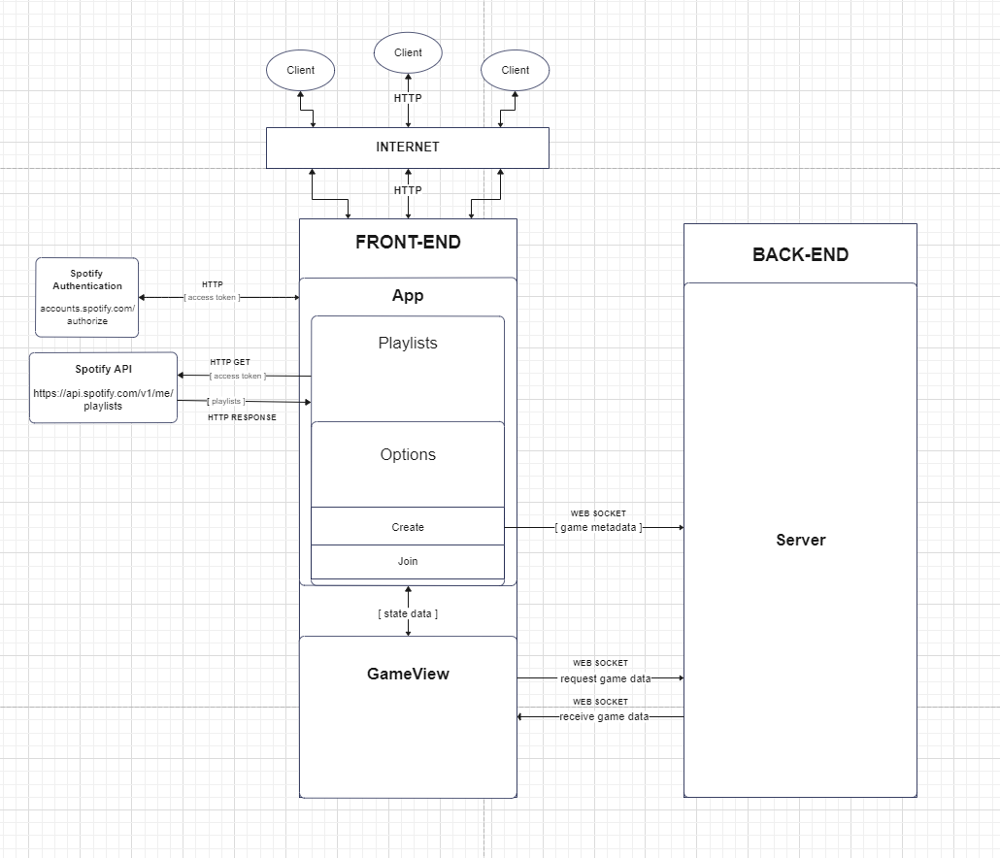

Authors: James Guiden, Alec Montesano, Owen Conlon

# Introduction
Guessify is a web-based game application built with React and NodeJS. Users can connect and play with their Spotify accounts by logging in and selecting a playlist to use. They can then choose to create or join a new game where they play through various rounds with other users while guessing whose playlist the currently queued song belongs to. Players are assigned points based on correct guesses with a leaderboard displaying the winner when an endgame state has been triggered.

Interfacing with Spotify's services and API allows for optimal user experience and ease of access.

    

# System Architecture
This system utilizes the client-server architecture model. In this model, the client or user typically initiates communication with the server by sending a request for a resource or service. The server then processes the request and sends the requested resource back to the client-side. This model provides a number of benefits, including improved scalability, easier maintenance and management, and enhanced security.

The following diagram demonstrates this architecture flow while depicting the front-end's nested React component nature. Conditional rendering is utilized within the front-end subcomponents to control UI flow, with each component providing a certain function whether that being communication with an API or collecting data to send as props.

    

# Installation
Proper installation instructions will be provided in the respective client and server directory README files. 

# References
https://developer.spotify.com/documentation/web-api/

https://legacy.reactjs.org/docs/getting-started.html

https://nodejs.org/en/docs

https://getbootstrap.com/docs/5.3/getting-started/introduction/

https://socket.io/docs/v4/

https://oauth.net/2/

https://axios-http.com/docs/intro
