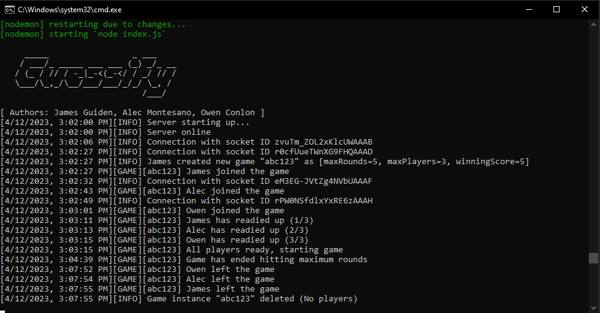

<p align="center"></p>
<p align="center"></p>
<p align="center">Authors: James Guiden, Alec Montesano, Owen Conlon</p>

# Back-End
This is the server-side of the Guessify application. It utilizes [Socket.io](https://socket.io) communication to send and recieve data with the front-end for processing and manipulation. 

## Installation
You will need to install the required NodeJS package dependencies.

> npm install --save socket.io

> npm install --save express

> npm install --save cors

> npm install --save nodemon

## Startup
Now that you have your environment and project structure setup, you are ready to start the back-end
* Open a terminal and navigate to the server folder
* Use ```npm start``` to start the project up
* The server is now active and listening for communication from the client-side

### Example Console Output
<p align="center"></p>
